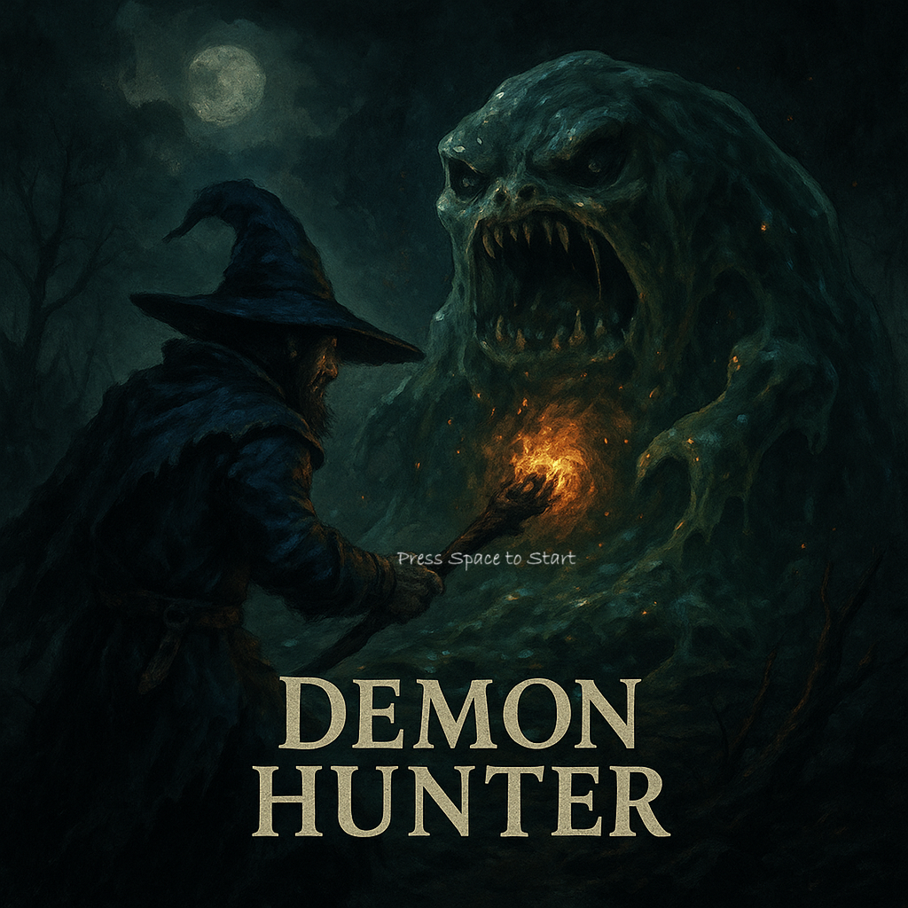
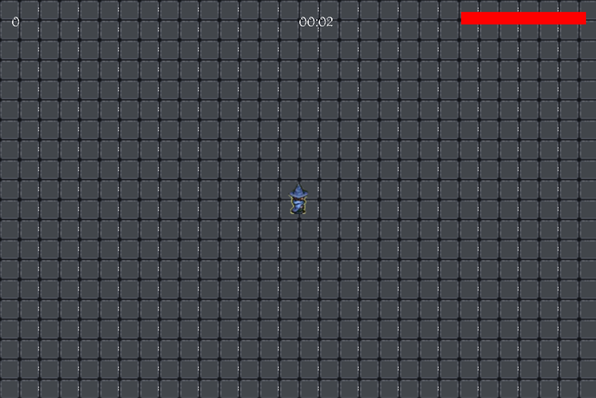
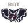
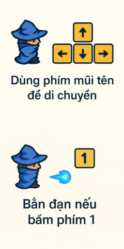
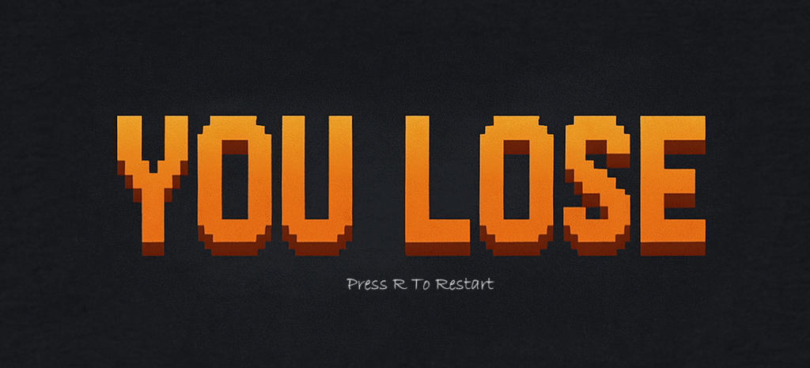

# Demon Hunter
---
# Giới thiệu game

Một tựa game hành động sinh tồn đánh quái, tiêu diệt quái vật trong rừng tối.

- [Giới thiệu game](#giới-thiệu-game)
-  [Cốt truyện](#cốt-truyện)
   1. [Thế giới](1thế-giới)
   2. [Bối cảnh](2bối-cảnh)
   3. [Nhiệm vụ](3nhiệm-vụ)
- [Bắt đầu game](#bắt-đầu-game)
- [Các nhân vật trong game](#các-nhân-vật-trong-game)
- [Gameplay](#gameplay)
- [Chiến thắng và thất bại](#chiến-thắng-và-thất-bại)

---

## Cốt truyện
1. Thế giới
- Từ hàng ngàn năm trước, thế giới từng bị thống trị bởi lũ quỷ dữ đến từ "Vực Sâu Vĩnh Hằng". Các vị Thần cổ xưa đã phong ấn chúng bằng một nghi lễ cấm kỵ, chôn vùi chúng dưới lòng đất.
Nhưng thời gian trôi qua, con người dần quên đi những lời cảnh báo cổ xưa… Cho đến khi ấn phong bị phá vỡ.
---
2. Bối cảnh
- Bạn vào vai Kael, một thợ săn quỷ lang thang, người duy nhất còn mang trong mình dòng máu của Đại pháp sư. Sau khi quê hương bị lũ quỷ tàn phá trong một đêm trăng máu, Kael thề sẽ săn lùng và tiêu diệt toàn bộ đám quái vật từ vực sâu.Lần theo dấu vết máu và tàn tro, bạn bước vào Darkwood, mảnh đất đã bị nguyền rủa – nơi những linh hồn, xác sống và quỷ dữ ngày đêm gào thét. Sau một thời gian săn lùng và tìm kiếm các manh mối về lũ quỷ Kael dần phát hiện ra: để phong ấn lũ quỷ mãi mãi, người thực hiện nghi lễ sẽ phải hy sinh bản thân. Liệu bạn sẽ hoàn thành sứ mệnh… hay bị bóng tối nuốt chửng?
---
3. 🔥 Nhiệm vụ
- Sống sót qua các đợt tấn công của quái vật
- Tiêu diệt những con quái vật bị nguyền rủa

## Bắt đầu game

- Người chơi bấm phím space để bắt đầu chơi

  <!-- Thêm ảnh menu chính -->

- Sau khi vào màn chơi sẽ hiện giao diện trò chơi

  <!-- Thêm ảnh menu chính -->

---

## Các nhân vật trong game trong game

| Nhân vật game                         | Tên nhân vật | Thông số cơ bản           |
|---------------------------------------|--------------|---------------------------| 
|                                       |              | Máu: 50                   |
|   |     Kael     | Sát thương: 10            |
|                                       |              | Tốc độ di chuyển: 30      | 
|                                       |              | Máu: 15                   |
|            |     Slime    | Sát thương: 10            |
|                                       |              | Tốc độ di chuyển: 7       |
|                                       |              | Thời gian spawn: Từ đầu   |
|                                       |              | Máu: 25                   |
|                                       |              | Sát thương: 15            |
|                |      bat     | Tốc độ di chuyển: 15      |
|                                       |              | Thời gian spawn: Sau 3'   |

---

## 🎮 Gameplay
- Người chơi bấm các phím mũi tên để di chuyển theo các hướng
- Người chơi bấm phím 1 để bắn đạn

 <!-- Thêm ảnh tutorial -->
---

## 🏆 Chiến thắng và thất bại

- Bạn sẽ chiến thắng nếu sống sót trông 20'

  <!-- Thêm ảnh chiến thắng -->

(Màn hình hiển thị lúc chiến thắng)

- Bạn sẽ thua cuộc nếu bị quái giết trong vòng 20'

  <!-- Thêm ảnh thất bại -->

(Màn hình hiển thị lúc thua cuộc)
